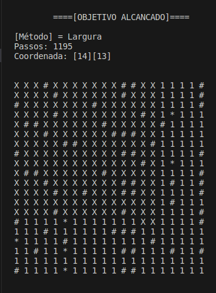

# AEDS: Labirinto por Profundidade (DFS) e Largura (BFS)

A pedido do professor de Algoritmos e Estruturas de Dados do CEFET - Divinópolis, foi feito um algoritmo em C++, que executa 3 modos distintos de caminhamento em uma matriz de tamanho N. Sendo eles de um de forma randômica, outro por largura e o último por profundidade.

# Sumário

- [Objetivo](#objetivo)
- [Especificações Gerais](#especificações-gerais)
- [Arquivos](#arquivos)
- [Randômico](#randômico)
- [Largura](#largura)
- [Profundidade](#profundidade)
- [Comparações entre algoritmos](#comparações-entre-algoritmos)
- [Saída](#saída)
- [Conclusão](#conclusão)

# Objetivo

Esse algoritmo tem como objetivo pegar uma matriz de tamanho N percorrer ela de 3 modos distintos: randômico, por profundidade e por largura até encontrar '?' enfrentando os perigos '*'. E ao final demonstrar a duração de cada modalidade.

# Especificações Gerais

Todos os algoritmos (randômico, largura e profundidade) tem como objetivo geral ler uma matriz NxN e executar um caminho até concluir o processo encontrando o caractere '?'. As condições abaixo serve para os 3 tipos de processamento:

<ul>
 <li>(1): significa passagem livre, logo toda vez que a posição for '1' é permitido caminhar sem nenhuma consequência.</li>
 <li>(#): significa parede, sendo estabelecido que é impossível andar para aquela posição que tiver '#'.</li>
 <li>(*): significa perigo, sendo que toda vez que a posição atual for '*' ela é substituída por '1' e o jogo é reinicializado na posição inicial.</li>
 <li>(?): significa parada, ao encontrar a posição que tenha '?' o caminhamento é finalizado pois o objetivo principal foi cumprido.</li>
</ul>

## Arquivo de Entrada

 <ul>
    <li>1 - A primeira linha deve ser destinada a dizer o tamanho da matriz e a quantidade de matriz presente no arquivo (neste algoritmo apenas uma), todos esse números separados por uma tecla de espaço ' '. </li>
    <li>2 - A matriz tem que ser quadráticas.</li>
    <li>3 - Os números de cada posição devem ser separado por um espaço que define a troca de coluna da matriz.</li>
    <li>4 - Ao final de cada linha da matriz deve ter um '\n' , ou seja pular a linha para simbolizar a próxima linha da matriz.</li>
 </ul>

## Caminhamento

Em todos os tipos de caminhamento encontrado neste código não é possível extrapolar as posições da matriz (ir além da linha/coluna), ou seja dependendo da posição atual existe condições que não permitem caminhar em determinada coordenada.

<ul>
  <li>Exemplicando as coordenadas possíveis: </li>
  

     
  

</ul>

# Arquivos

* `input.data`: arquivo onde as matrizes que serão processadas estão salvas;
* `main.cpp`: arquivo responsável de inicializar lendo o tamanho da matriz, por criar alocação dinâmica das matrizes e executar cada modelo de caminhamento;
* `Fila.cpp`: arquivo que se encontram as funções de uma Fila que foram declaradas no arquivo `Fila.hpp`;
* `Pilha.cpp`: arquivo que se encontra as funções de uma Pilha que foram declaradas no arquivo `Pilha.hpp`;
* `Posicao.cpp`: arquivo que se encontra as funções da classe Posição que foi declarada no arquivo `Posicao.hpp`, onde também se encontra a struct da matriz com índice e elemento que é usada na profundidade e largura;
* `randomico.cpp`: arquivo que se encontra as funções que executa a caminhamento de forma randômica, que foram declaradas no arquivo `randomico.hpp`;
* `profundidade.cpp`: arquivo que se encontra as funções que executa a caminhamento com o modelo de profundidade, que foram declaradas no arquivo `profundidade.hpp`;
* `largura.cpp`: arquivo que se encontra as funções que executa a caminhamento com o modelo de largura, que foram declaradas no arquivo `largura.hpp`;

# Randômico

O caminhamento é feito de forma aleatória nesse algoritmo, ou seja, a partir da posição inicial ele sorteia a próxima posição até conseguir cumprir o objetivo de encontrar o '?'.         

## Lógica

Primeiramente faz a leitura da matriz no input.data. Apartir da posição (x,y) = (0,0) faz o primeiro sorteio da próxima posição e confere se é um caminhamento possível (diferente de parede e que não extrapola a matriz), esse processo é realizado até encontrar uma posição possível. Encontrado uma posição é feito o caminhamento, e confere se ele é perigo '*' ou parada '?', em caso de perigo ele muda a posição atual para '1' e reinicia novamente na posição (0,0), mas se for parada o programa é finalizado, ademais se for '1' é feito um novo sorteio. Ao final ele printa a matriz com 'X' nas posições que foram caminhadas.

## Funções

  * `void tamanho_e_quantidade(int *tamanho, int *quantidade)`: ler o tamanho da matriz presente no arquivo input.data;
  * `void leitura_arquivo(string **matriz)`: faz a leitura do arquivo gerando uma matriz para ser processada;
  * `tuple<bool, bool> verificar_possibilidade(...)`: essa função verifica se a possição a ser andada é possível; retornando se tem parede ou extrapola a matriz;
  * `bool verificar_perigo(...)`: essa função olhar se a posição atual é perigo e retorna uma variavel booleana;
  * `bool verificar_parada(...)`: retorna uma variavel booleana informando a presença ou não do '?';
  * `void caminhar_randomico(...)`: nessa função faz a leitura do arquivo através da função `void leitura_arquivo(string **matriz)`, faz o sorteio de uma direção e verificar se atende aos criterios estabelicidos com a função `tuple<bool, bool> verificar_possibilidade(...)` e faz o caminhamento, a cada nova direção andada verifica se ela foi perigo ou parada através da funções `bool verificar_perigo(...)` e `bool verificar_parada(...)`, em caso de parada satisfazer o critério o algoritmo do randômico é finalizado;

# Largura

A busca em largura, também conhecida como BFS (breadth-first search), é um algoritmo utilizado para percorrer ou buscar elementos em uma estrutura de dados do tipo grafo. Nesse contexto, a matriz é vista como um grafo, onde cada elemento representa um vértice e as conexões entre os elementos (vizinhos) representam as arestas. A busca começa a partir de um vértice inicial e explora todos os vértices vizinhos antes de avançar para os próximos elementos. Nesse caso, é utilizado uma estrutura de dados do tipo fila, para manter o controle dos vértices que já foram visitados. Dessa forma, a busca em largura sempre adiciona o vértice inicial em uma fila, explora todos os seus vizinhos, formando um raio, adiciona-os na fila, e em seguida caminha para o mesmo vértice inicial, o remover da fila. Esse método garante que todos os vértices em uma mesma camada serão visitados antes de explorar os vértices da próxima camada, e que isso se repetirá até que todos os vértices sejam visitados ou até que a condição de busca desejada seja atendida. O percurso realizado seguindo a ordem crescente dos números representados na imagem abaixo (esse números não estão presentes na matriz lida do input.data).

<ul>
  <li>Exemplicando: </li>
  

     
  

</ul>

## Lógica:

  Inicialmente, o arquivo denominado "input.data" é aberto para fins de leitura, e o valor correspondente ao tamanho do labirinto é obtido por meio da função tamanho_matriz, a fim de permitir a alocação dinâmica de uma matriz de structs. A matriz de structs é composta por um tipo string, onde reside o elemento da matriz, e um tipo int, onde é armazenado o índice da matriz. Para preencher a matriz com todos os elementos do arquivo e iniciar os índices com "0", utiliza-se a função leitura_arquivo_2. Após recarregar a matriz, a função caminhar_largura é chamada, com os parâmetros de tamanho e matriz. Essa função executa todo o processo de busca. Primeiramente, é criada uma fila, utilizada como controle dos elementos visitados, na qual as coordenadas iniciais da matriz (0,0) são inseridas. Enquanto o objetivo da busca não é alcançado, um loop "while" realiza os seguintes procedimentos:

<ul align="justify">
  <li>Os elementos da fila são acessados um por um, e todos os vizinhos correspondentes são verificados. Caso o vizinho tenha um índice igual a "0", suas coordenadas são adicionadas ao final da fila. Após cada inserção, o índice do vizinho é atualizado para "1". A verificação e atualização do índice é importante para que não ocorra a inserção de coordenadas que já foram verificadas anteriormente na fila.</li>
  <li>Após todos os vizinhos dos elementos previamente presentes na fila serem adicionados, a matriz é direcionada para esses vizinhos, e eles são removidos da fila, tendo seus índices modificados para "2".</li>
  <li>Esse processo é realizado com o auxílio de dois contadores adicionais, que registram a quantidade de elementos presentes na fila antes e após a adição de todos os vizinhos, permitindo a execução desse processo em um segundo loop utilizando esses contadores como parâmetros.</li>
  <li>Se a coordenada removida da fila possuir um elemento comum igual a "1", a posição correspondente é percorrida, atualizando-se a linha e coluna da matriz para essa posição.</li>
  <li>Se a coordenada removida da fila representar um perigo, o elemento é atualizado para "1", e as variáveis relevantes são todas zeradas: as linhas e colunas, tanto auxiliares quanto oficiais, os contadores, os índices dos elementos (utilizando a função `reiniciar_indices`), e a fila. Em seguida, a coordenada (0,0) é novamente adicionada à fila, para reiniciar a busca a partir da origem, sem o perigo na posição em que foi encontrado anteriormente.</li>
  <li>Se a coordenada removida da fila corresponder a uma parede, ela é simplesmente removida da fila, sem direcionar a linha e coluna para essa posição.</li>
  <li>Se a coordenada removida da fila for o objetivo da busca (representado por "?"), sua posição é percorrida e o loop é encerrado.</li>
</ul>

## Funções

  * `void leitura_arquivo_2(nova_Matriz **matriz)`: faz a leitura do arquivo input.data gerando uma matriz para ser processada;
  * `tuple<bool, bool> verificar_possibilidade2(...)`: essa função verifica se a posição a ser andada já foi andada ou está livre através das funções `void direita(..), void diagonal_direita_abaixo(...) e void baixo(...)`;
  * `void direita(..), void diagonal_direita_abaixo(...) e void baixo(...)`: essa função define se as respectivas coordenadas são possíveis e se já foram andadas;
  * `void reiniciar_indices(...)`: essa função reinicia os índices da matriz de struct criada para os valores iniciais (zero);
  * `void caminhar_largura(...)`: nessa função faz a execução de toda a lógica ;

# Profundidade

A busca por profundidade ou busca DFS (Depht-fisrt search) é um processo sistemático (algoritmo) usado para percorrer os vértices e arestas de um grafo. Neste projeto a busca será realizada por uma matriz ao invés de um grafo. O método consiste em escolher uma direção e continuar o caminho somente nela, caminhando o mais profundo possível , o algoritmo avança o máximo possível em um ramo da estrutura antes de ir para a próxima.

<ul>
  <li>Exemplicando: </li>
  

     
  

</ul>

## Lógica

Para o caminhamento por esses métodos foi implementada uma matriz de struct, são como duas matrizes interligadas. Uma irá conter o "mapa" ou seja, as informações lidas no arquivo. Para acessar esses dados é necessário usar matriz[x][y].elemento, pois a variável elemento que guarda esses dados. A outra matriz irá guardar os índices 0, 1 ou 2, que representam: 

- 0 caminho não descoberto. 
- 1 Posições vizinhas daquela coordenada já foram armazenadas. 
- 2 Coordenada já percorrida e também já verificado seus vizinhos. 

Para este método foi usada a implementação de uma Pilha, a qual os elementos são sempre inseridos no início e tirados dele também. Há uma variável intitulada tam_pilha declaradada na classe Pilha, que conta a quantidade de elementos que ela possui. Além disso, existem funções para manipulação da pilha, são elas: 

- inserir:  adiciona o elemento no topo. 
- retirardapilha:  remover o elemento do topo. 
- imprimir_pilha:  imprimir elementos armazenados

A busca em profundidade de uma direção só é interrompida se for encontrado um obstáculo ou chegue ao limite da matriz.
Caso isso aconteça, o código passa para a próxima direção, de acordo com a ordem de preferência estabelecida e continua o caminhamento por ela. Todas as coordenadas (x,y) percorridas são inseridas na pilha, desde que o índice dessa posição seja zero. Pois uma vez que a posição foi acessada ela não pode ser visitada novamente e seu índice se torna um.

Para descobrir se o algoritmo está preso por obstáculos ou cercado de posições já visitadas, é verificado se a pilha aumentou de tamanho toda vez que se verificou as 8 possibilidades de caminhamento. Se o tamanho aumentar significa que a busca em profundidade contínua, caso não, significa que não existe nenhuma possibilidade de caminhamento para a posição atual, então é necessário desempilhar as posições até encontrar uma que seja possível de percorrer para algum lado.

O desempilhamento ocorre da seguinte forma: Faz-se o acesso ao topo da pilha que é a posição atual e a remove. Consequentemente, o algoritmo volta para a posição anterior e verifica se existe alguma direção a partir dela em que ele possa continuar sua busca em profundidade. O desempilhamento é feito até encontrar uma nova coordenação possível.

Cada direção de caminhamento possui uma função própria que verifica se a posição que se deseja ir extrapola os limites da matriz, se é parede (#), perigo (*), se o índice é igual a 1 ou se é um caminho livre.

Para todas as vezes que se encontra perigo (*) e retorna a posição matriz[0][0] todos os elementos da pilha são removidos e ela se torna vazia para iniciar um novo percurso.
Função reiniciar_indices2 Responsável por reinicializar todos os índices da matriz[x][y].indice como zero novamente, já que o percurso irá começar de novo.

## Funções

  * `void tamanho_e_quantidade(int *tamanho, int *quantidade)`: ler o tamanho da matriz presente no arquivo input.data;
  * `void leitura_arquivo2(string **matriz)`: faz a leitura do arquivo gerando uma matriz para ser processada;
  * `funcao_switch(...)`: Aciona atráves dos cases as direções de caminhamento. `direita_2(..)`, `void diagonal_direita_abaixo_2(...)`, `void baixo_2(...)`,
  * `diagonal_esquerda_abaixo_2`, `void esquerda_2(..)`, `diagonal_esquerda_acima_2`, `void cima'_2(...)`,  `void diagonal_direita_acima_2(...)`, 
  * `caminhar_profundidade(...)`: Função principal do método. Chama as funções de caminhar, verificações e validações da posição. É executada até atingir o objetivo do algoritmo. 
  * `reiniciar_indices2(...)`: Modifica todos os índices para zero novamente.
  * `reiniciando_perigo(...)`: Ao encontrar perigo *, o algoritmo retorna a posição[0][0] e realiza todos os procedimentos para reiniciar o percurso mais uma vez.
  * `void inserir(Posicao* novo)`: Inseri a posição no topo da pilha.
  * `void imprimir_pilha()`: Imprimi todos os elementos da pilha.
  * `void retirardapilha()`: Retira o elemento do topo da pilha.

# Comparações entre algoritmos

### Usando as matrizes (50x50) disponíveis no arquivo `teste.data`;

  <ul>
    <li><b>Caso 1:</b> utilizando a primeira matriz (padrão).</li>
    <li><b>Caso 2:</b> utilizando a segunda matriz (com mais perigos).</li>
    <li><b>Caso 3:</b> utilizando a terceira matriz (com mais parede).</li>
  </ul>

### Caso 1
<ul>
  <li><b>Melhor caso:</b> '?' no inicio (x,y)=(0,1);</li>
    <ul>
      <li> Randômico: 1.45ms e 1 passo.</li>
      <li> Largura: 0.87ms e 1 passo - (40% melhor que o randômico).</li>
      <li> Profundidade: 0.73ms e 1 passo - (49% melhor que o randômico).</li>
    </ul>
  <li><b>Caso médio:</b> '?' no meio, (x,y)=(24,24).</li>
    <ul>
        <li> Randômico: 2.05ms e 2419 passos.</li>
        <li> Largura: 2.22ms e 3330 passos - (8,29% pior que o randômico).</li>
        <li> Profundidade: 0.86ms e 6198 passos - (58% melhor que o randômico).</li>
    </ul>
  <li><b>Pior caso:</b> '?' no final, (x,y)=(49,49) .</li>
  <ul>
      <li> Randômico: 7.18ms e 67.433 passos.</li>
      <li> Largura: 20.75ms e 53.575 passos - (188% pior que o randômico).</li>
      <li> Profundidade: 0.30ms e 176 passos - (95% melhor que o randômico).</li>
    </ul>
</ul>

### Caso 2
<ul>
  <li><b>Melhor caso:</b> '?' no inicio (x,y)=(0,1);</li>
    <ul>
      <li> Randômico: 0.48ms e 10 passos.</li>
      <li> Largura: 0.27ms e 1 passo - (43,75% melhor que o randômico).</li>
      <li> Profundidade: 0.28ms e 1 passo - (41,67% melhor que o randômico).</li>
    </ul>
  <li><b>Caso médio:</b> '?' no meio, (x,y)=(24,24).</li>
    <ul>
        <li> Randômico: 2.52ms e 19.261 passos.</li>
        <li> Largura: 2.95ms e 6.641 passos - (17,06% pior que o randômico).</li>
        <li> Profundidade: 1.43ms e 12.180 passos - (43,25% melhor que o randômico).</li>
    </ul>
  <li><b>Pior caso:</b> '?' no final, (x,y)=(49,49) .</li>
  <ul>
      <li> Randômico: 21.38ms e 214.680 passos.</li>
      <li> Largura: 56.82ms e 145.880 passos - (165% pior que o randômico).</li>
      <li> Profundidade: 0.46ms e 610 passos - (97,84% melhor que o randômico).</li>
    </ul>
</ul>

### Caso 3
<ul>
  <li><b>Melhor caso:</b> '?' no inicio (x,y)=(0,1);</li>
    <ul>
      <li> Randômico: 0.52ms e 1 passo.</li>
      <li> Largura: 0.29ms e 1 passo - (45,23% melhor que o randômico).</li>
      <li> Profundidade: 0.28ms e 1 passo - (85,71% melhor que o randômico).</li>
    </ul>
  <li><b>Caso médio:</b> '?' no meio, (x,y)=(24,24).</li>
    <ul>
        <li> Randômico: 1.75ms e 11.542 passos.</li>
        <li> Largura: 1.71ms e 3.416 passo - (2,28% melhor que o randômico).</li>
        <li> Profundidade: 5.42ms e 30.707 passos - (209% pior que o randômico).</li>
    </ul>
  <li><b>Pior caso:</b> '?' no final, (x,y)=(49,49) .</li>
  <ul>
      <li> Randômico: 11.89ms e 110.083 passos.</li>
      <li> Largura: 30.93ms e 67.738 passos - (160% pior que o randômico).</li>
      <li> Profundidade: 0.68ms e 2.698 passos - (94% melhor que o randômico).</li>
    </ul>
</ul>

# Saída

<ul>
  <li>Matriz do arquivo: </li>
  

     
  

</ul>

<ul>
  <li>Randômico: </li>
  

     
  

</ul>

<ul>
  <li>Largura: </li>
  

     
  

</ul>

<ul>
  <li>Profundidade: </li>
  

     
  

</ul>

<ul>
  <li>Final: </li>
  

     
  

</ul>

# Conclusão

  O projeto apresentado abordou três métodos de busca, sendo eles o randômica, busca em largura e profundidade. Cada um deles possui suas especificidades e foi perceptível que cada um se encaixa melhor para certos tipos de problemas. 

  Em termos de análise assintótica, não é possível calcular o custo de um algoritmo randômico devido a natureza aleatória de suas decisões que são independentes umas das outras. No entanto, o algoritmo pode percorrer todo o espaço de busca antes de alcançar o objetivo, resultando em um custo de tempo exponencial, que seria o pior cenário. Além disso, em média, o tempo de execução pode ser menor dependendo da distribuição de probabilidade do espaço de busca e da posição do resultado item procurado. 
  A busca em largura explora o raio dos vizinhos de posição da matriz que se encontra no momento.
  Ela garante que o elemento procurado seja encontrado mais rápido, mas pode consumir muita memória e tempo de execução em espaços de busca muito grandes, e principalmente se o item buscado estiver no final da estrutura analisada. 
  A busca em profundidade explora direções específicas o mais fundo possível. Ela é mais eficiente em espaços de busca com muitas ramificações e menos profundos. No entanto, pode ficar presa em ciclos infinitos ou caminhos de busca extensos, desperdiçando tempo explorando áreas irrelevantes. 

  Com base no projeto apresentado e nas regras estabelecidas, em geral e considerando o caso médio de custo computacional, podemos fazer as seguintes observações: quando há muitos perigos (*),  o método de busca em largura se apresenta como pior algoritmo a ser implementado, enquanto a busca em profundidade se mostra muito mais eficiente. Por outro lado, na presença de muitos obstáculos (#), o método de busca em largura é mais rápido e mais adequado do que a busca em profundidade. Para todos os casos estudados, é observado que tanto o método de busca em largura quanto o método de busca em profundidade são mais eficazes do que o método randomico para este trabalho específico.

# Compilação e Execução

Esse pequeno exemplo possui um arquivo Makefile que realiza todo o procedimento de compilação e execução.  Para tanto, temos as seguintes diretrizes de execução:

| Comando                |  Função                                                                                           |                    
| -----------------------| ------------------------------------------------------------------------------------------------- |
|  `make clean`          | Apaga a última compilação realizada contida na pasta build                                        |
|  `make`                | Executa a compilação do programa utilizando o gcc, e o resultado vai para a pasta build           |
|  `make run`            | Executa o programa da pasta build após a realização da compilação           

# Contatos
<a>
✉️ <i>lucaslimadeoliveira80@gmail.com</i> 
✉️ <i>nalauramoura@gmail.com</i> 
✉️ <i>mariana.itapec@gmail.com</i>
</a>

